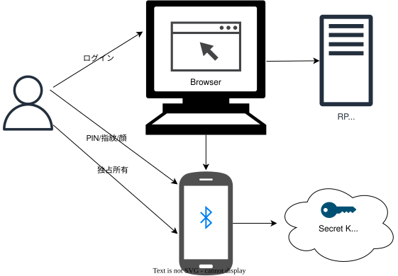
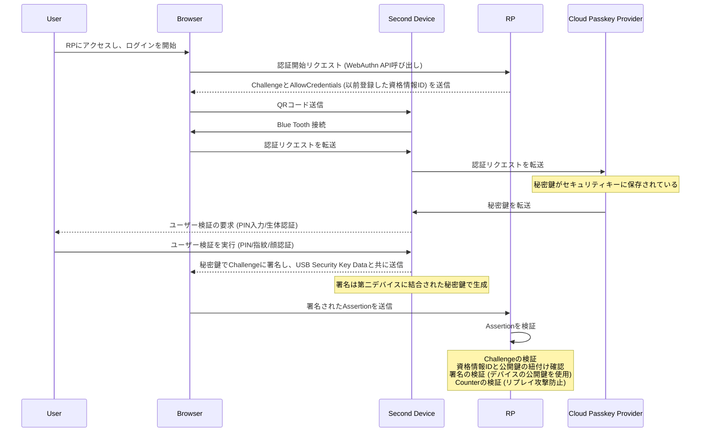

## デバイス横断

BrueToothで通信可能な別端末でFIDO認証。

```mermaid
sequenceDiagram
    participant User
    participant Browser
    participant Second Device
    participant RP
    participant Cloud Passkey Provider

    User->>Browser: RPにアクセスし、ログインを開始
    Browser->>RP: 認証開始リクエスト (WebAuthn API呼び出し)
    RP-->>Browser: ChallengeとAllowCredentials (以前登録した資格情報ID) を送信

    Browser->>Second Device: QRコード送信
    Second Device->>Browser: Blue Tooth 接続

    Browser->>Second Device: 認証リクエストを転送
    Second Device->>Cloud Passkey Provider: 認証リクエストを転送
    Note over Cloud Passkey Provider: 秘密鍵がセキュリティキーに保存されている
    Cloud Passkey Provider->>Second Device: 秘密鍵を転送
    Second Device-->>User: ユーザー検証の要求 (PIN入力/生体認証)
    User->>Second Device: ユーザー検証を実行 (PIN/指紋/顔認証)

    Second Device-->>Browser: 秘密鍵でChallengeに署名し、USB Security Key Dataと共に送信
    Note over Second Device: 署名は第二デバイスに結合された秘密鍵で生成

    Browser->>RP: 署名されたAssertionを送信
    RP->>RP: Assertionを検証
    Note over RP: Challengeの検証<br>資格情報IDと公開鍵の紐付け確認<br>署名の検証 (デバイスの公開鍵を使用)<br>Counterの検証 (リプレイ攻撃防止)
```
