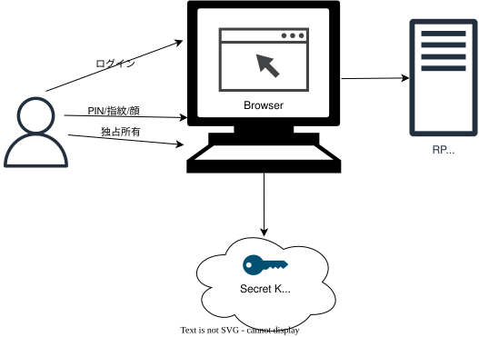
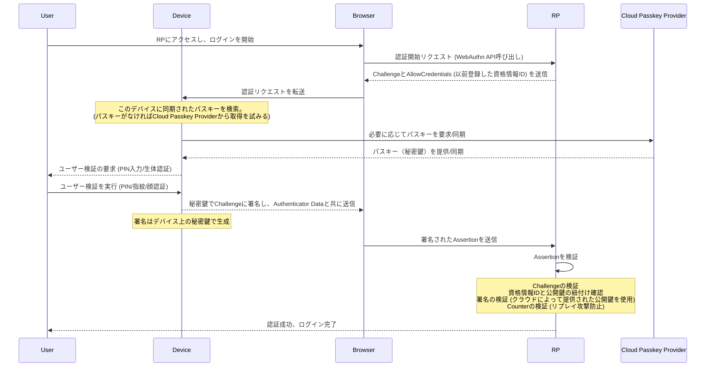

## 同期型パスキー

クラウド上に保存されるパスキー。

```mermaid
sequenceDiagram
    participant User
    participant Device
    participant Browser
    participant RP
    participant Cloud Passkey Provider

    User->>Browser: RPにアクセスし、ログインを開始
    Browser->>RP: 認証開始リクエスト (WebAuthn API呼び出し)
    RP-->>Browser: ChallengeとAllowCredentials (以前登録した資格情報ID) を送信

    Browser->>Device: 認証リクエストを転送
    Note over Device: このデバイスに同期されたパスキーを検索。<br/>(パスキーがなければCloud Passkey Providerから取得を試みる)

    Device->>Cloud Passkey Provider: 必要に応じてパスキーを要求/同期
    Cloud Passkey Provider-->>Device: パスキー（秘密鍵）を提供/同期

    Device-->>User: ユーザー検証の要求 (PIN入力/生体認証)
    User->>Device: ユーザー検証を実行 (PIN/指紋/顔認証)

    Device-->>Browser: 秘密鍵でChallengeに署名し、Authenticator Dataと共に送信
    Note over Device: 署名はデバイス上の秘密鍵で生成

    Browser->>RP: 署名されたAssertionを送信
    RP->>RP: Assertionを検証
    Note over RP: Challengeの検証<br/>資格情報IDと公開鍵の紐付け確認<br/>署名の検証 (クラウドによって提供された公開鍵を使用)<br/>Counterの検証 (リプレイ攻撃防止)

    RP-->>User: 認証成功、ログイン完了
```
