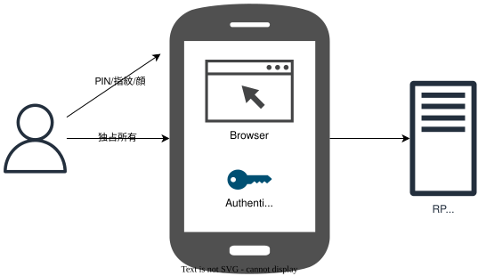
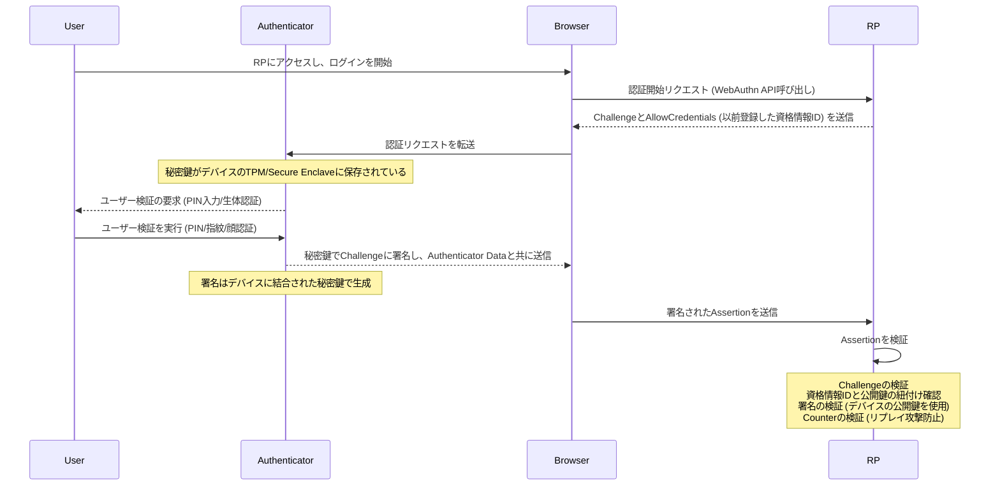

## オンデバイスパスキー

```mermaid
sequenceDiagram
    participant User
    participant Authenticator
    participant Browser
    participant RP

    User->>Browser: RPにアクセスし、ログインを開始
    Browser->>RP: 認証開始リクエスト (WebAuthn API呼び出し)
    RP-->>Browser: ChallengeとAllowCredentials (以前登録した資格情報ID) を送信

    Browser->>Authenticator: 認証リクエストを転送
    Note over Authenticator: 秘密鍵がデバイスのTPM/Secure Enclaveに保存されている

    Authenticator-->>User: ユーザー検証の要求 (PIN入力/生体認証)
    User->>Authenticator: ユーザー検証を実行 (PIN/指紋/顔認証)

    Authenticator-->>Browser: 秘密鍵でChallengeに署名し、Authenticator Dataと共に送信
    Note over Authenticator: 署名はデバイスに結合された秘密鍵で生成

    Browser->>RP: 署名されたAssertionを送信
    RP->>RP: Assertionを検証
    Note over RP: Challengeの検証<br>資格情報IDと公開鍵の紐付け確認<br>署名の検証 (デバイスの公開鍵を使用)<br>Counterの検証 (リプレイ攻撃防止)
```

